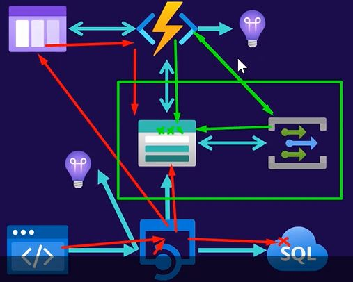
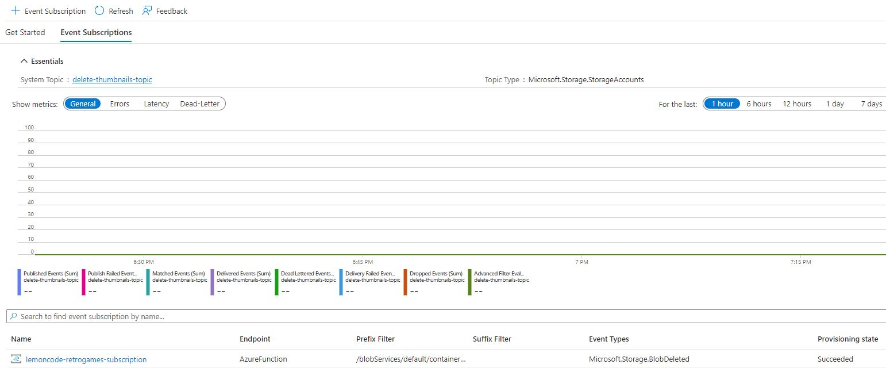
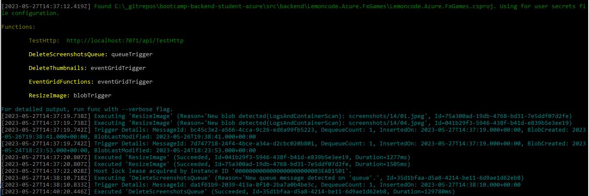
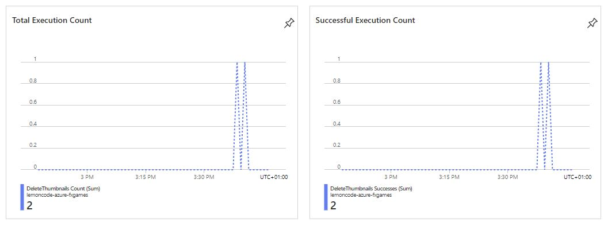
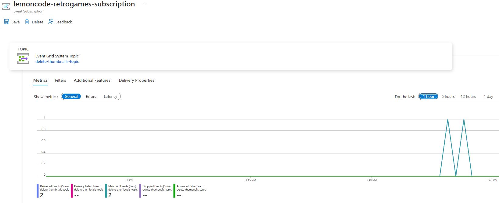

# Azure - Relational - Module 3
1. [Exercise](#exercise)
2. [Prerequisites](#prerequisites)
3. [Basic Solution](#basic-solution)
4. [Advanced Solution](#advanced-solution)
5. [Configure the Event Grid architecture](#event-grid-architecture)
6. [Testing locally the Event Subscription](#testing-locally-event-subscription)
7. [End to End testing](#e2e-testing)

<a name="exercise"></a>
## 1. Exercise
The aim of this lab is to use some of the concepts learnt during the sessions such as Azure Storage Blob, Azure Storage Queue, Azure Functions and Azure Event Grid.

For this exercise you would need to delete a database record and its images associated stored in Azure Storage. 

<a name="prerequisites"></a>
## 2. Prerequisites
The Azure services and database populated required for this solution can be found [here](doc/README.md).

<a name="basic-solution"></a>
## 3. Basic Solution
1. The user sends an API request to an endpoint to delete a game, passing the identifier of the game, e.g. 14.
2. The api deletes that game from a sql database using Entity Framework.
3. The api deletes its images (.jpg) stored in blobs inside an Azure storage account. This storage account includes a container (here called screenhots) with the blobs that need to be deleted.

   Pseudo code of this solution is the following:
   In GamesController.cs class
   ```
   [HttpDelete("{id}")]
   public async Task<IActionResult> DeleteGame(int id)
   {
     var game = await context.Game.FindAsync(id);
     if (game == null)
     {
        return NotFound();
     }

     context.Game.Remove(game);
     await context.SaveChangesAsync();

     // Start Basic Solution
     await this.blobService.DeleteFolderBlobs("screenshots", id.ToString());
     // End Basic Solution

     return NoContent();
   }
   ```

<a name="advanced-solution"></a>
## 4. Advanced Solution 
A more efficient way is delegating the deletion of the screenshots blobs (step 3) to an Azure Function triggered by a message on a Azure Queue. 
If we would also like to have a process that, when a file is deleted from the screenshots blob storage, it’s automatically deleted from the thumbnails blob storage, then using an Azure Event Grid will bring a more powerful and reliable process in the cloud.

The previously described process can be implemented as in the following diagram:


These are the steps of the process:
1. The same as previous solution
2. The same as previous solution
3. The api sends a message with the identifier of the deleted game, e.g. 14, to an Azure Queue. This message triggers a serverless Azure Function instance (here called `DeleteScreenshotsQueue`) passing the identifier of the deleted game, e.g. 14.
   
   Pseudo code of this solution is the following:
   In GamesController.cs class
   ```
   [HttpDelete("{id}")]
   public async Task<IActionResult> DeleteGame(int id)
   {
     var game = await context.Game.FindAsync(id);
     if (game == null)
     {
        return NotFound();
     }

     context.Game.Remove(game);
     await context.SaveChangesAsync();

     // Start Advanced Solution
     await this.queueService.CreateQueueAndSendMessage(id.ToString());
     // End Advanced Solution

     return NoContent();
   }
   ```

   ```
   namespace Lemoncode.Azure.Api.Services
   {
    public class QueueService
    {
        private readonly StorageOptions storageOptions;

        public QueueService(
            IOptions<StorageOptions> storageOptionsSettings
        )
        {
            this.storageOptions = storageOptionsSettings.Value;
        }

        // Azure Queue storage is a service for storing large numbers of messages that
        // can be accessed from anywhere in the world via authenticated calls using
        // HTTP or HTTPS, e.g. "https://MYSTORAGEACCOUNT.queue.core.windows.net/QUEUENAME".
        // A single queue message can be up to 64 KB in size, and a
        // queue can contain millions of messages, up to the total capacity limit of
        // a storage account.
        public async Task CreateQueueAndSendMessage(string message)
        {
            // Connection string to your Azure Storage account
            string connectionString = storageOptions.ConnectionString;

            // Name of the queue we'll send messages to
            string queueName = storageOptions.ScreenshotsQueue;

            // Get a reference to a queue and then create it
            QueueClient queue = new QueueClient(connectionString, queueName, new QueueClientOptions
            {
                MessageEncoding = QueueMessageEncoding.Base64 // or QueueMessageEncoding.None
            });
            if (null != await queue.CreateIfNotExistsAsync())
            {
                Console.WriteLine("The queue was created.");
            }

            // Send a message to our queue
            await queue.SendMessageAsync(message);
        }
    }
   }
   ```

4. The Azure Function handles the deletion of the blobs inside the `screenshots` storage container, like:
   * Logging the identifier of the deleted game on Azure Application Insights.
   * Deleting all the 'screenshots' blob storage within the folder specified by the message.

   Pseudo code of this solution is the following:
   ```
   [FunctionName("DeleteScreenshotsQueue")]
    public async Task DeleteScreenshotsFunctionQueue(
        [QueueTrigger("queue", Connection = "AzureWebJobsGamesStorage")] 
        string message)
    {
        logger.LogInformation("Queue trigger - Screenshots blob deletion started...");
        try
        {
            await this.DeleteFolderBlobs("screenshots", message);
        }
        catch (Exception ex)
        {
            logger.LogError("Queue trigger - Error: " + ex.ToString());

            throw;
        }

        logger.LogInformation($"Queue trigger - Screenshots blob deletion completed: { message }");
    }
    ```

    ```
    private async Task DeleteFolderBlobs(string container, string folder)
    {
        var storageConnection = Environment.GetEnvironmentVariable("AzureWebJobsGamesStorage");
        BlobContainerClient containerClient = new BlobContainerClient(storageConnection, container);

        var folderBlobs = containerClient.GetBlobsAsync(prefix: folder);
        await foreach (var blobItem in folderBlobs)
        {
            BlobClient blobClient = containerClient.GetBlobClient(blobItem.Name);
            await blobClient.DeleteIfExistsAsync();
            logger.LogInformation($"Screenshots blob deletion completed: {blobItem.Name}");
        }
    }
    ```

5. A blob storage (here called screenhots) sends a deletion event to Azure Event Grid every time a blob is deleted.
6. The Azure Event Grid triggers an Azure Function instance (here called DeleteThumbnails).
7. The Azure Function handles the deletion of `thumbnails` blob storage, like:
   * Retrieving the deleted file and its folder from the url field to identify the blob name to delete.
   * Deleting it from the `thumbnails` storage container.
   * Logging the deleted blob name on Azure Application Insights.

   Pseudo code of this solution is the following:
   ```
   [FunctionName("DeleteThumbnails")]     
    public static async Task DeleteThumbnails([EventGridTrigger] EventGridEvent eventGridEvent, ILogger log)
    {
        log.LogInformation("Thumbnails blob deletion started...");

        StorageBlobDeletedEventData deletedEvent = eventGridEvent.Data.ToObjectFromJson<StorageBlobDeletedEventData>();
        var storageConnection = Environment.GetEnvironmentVariable("AzureWebJobsGamesStorage");           

        try
        {
            var blobName = GetBlobNameFromUrl(deletedEvent.Url);

            BlobClient blobClient = new BlobClient(
                        storageConnection,
                        "thumbnails",
                        blobName);

            await blobClient.DeleteAsync();
        }
        catch (Exception ex)
        {
            log.LogError("Blob deletion error: " + ex.Message);
        }
        finally
        {
            log.LogInformation("Thumbnails blob deletion completed: {blobName}");
        }
    }
   ```

<a name="event-grid-architecture"></a>
## 5. Configure the Event Grid architecture

The main part here is to configure the Event Grid source and destination. 
Get started with [Functions Event Grid Blob Trigger](https://learn.microsoft.com/en-us/azure/azure-functions/functions-event-grid-blob-trigger?pivots=programming-language-csharp).

In order to have events correctly triggered in a subscription, you need to have the Event Grid provider enabled. To do that, select your subscription, then click on Resource Providers and search for “Microsoft.EventGrid“. If the provider is not registered, click on Register to enable it.

These are the values provided to create our event grid subscription:
|Properties     |  Value 	| 
| ----------    |----------------- |
| Name | lemoncode-retrogames-subscription |
| Event schema | Event Grid Schema |
| Topic type | Storage accounts |
| System Topic Name | delete-thumbnails-topic |
| Filter to Event Types | Blob Deleted |
| Endpoint Type | Azure Function |
| Endpoint | DeleteThumbnails |

What happens when you create the above event grid subscription?

If you select your storage account and click on Events, you can see that an event subscription is added:


The created event subscription uses a function in Azure as a handler for events. In this way, Azure Event Grid calls `DeleteThumbnails` Azure function when the deletion event is fired in the blob storage.

An event handler is the place where the event is sent. The handler takes an action to process the event. Several Azure services are automatically configured to handle events and Azure Functions is one of them.


With the event grid subscription you can also apply filtering on subjects. For example to handle this process only if a jpg file is deleted from the storage account (so, process triggered if a .jpg file is deleted and not triggered if a .pdf file is deleted).

To do that, select your storage account (here called `lemoncodeazure`), click on Events and then select your registered event subscription (here called `lemoncode-retrogames-subscription`). In the Filters tab of the event subscription, if you check `Enable Subject filtering` then you can specify to filter events to only JPEG files:
|Properties     |  Value 	| 
| ----------    |----------------- |
| Subject Begins With | /blobServices/default/containers/screenshots/ |
| Subject Ends With | .jpg |

More information in [Manually create resources for Event Grid Subscription](https://learn.microsoft.com/en-us/azure/data-explorer/ingest-data-event-grid-manual).


<a name="testing-locally-event-subscription"></a>
## 6. Testing locally the Event Subscription
1. Run your Azure Function project.
2. Use a Postman Request to delete a file from the screenshots blob storage e.g. `screenshots/14/04.jpg` as follows:
   * POST  http://localhost:7071/runtime/webhooks/EventGrid?functionName=DeleteThumbnails
   * Request Headers:

     `aeg-event-type`: Notification
   * Request Body:  

    ```
    [
     {
        "topic": "/subscriptions/YOURSUBSCRIPTIONID/resourceGroups/Storage/providers/Microsoft.Storage/storageAccounts/lemoncodeazure",
        "subject": "/blobServices/default/containers/screenshots/blobs/14/04.jpg",
        "eventType": "Microsoft.Storage.BlobDeleted",
        "eventTime": "2023-05-18T20:09:22.5674003Z",
        "id": "4c2359fe-001e-00ba-0e04-58586806d298",
        "data": {
            "api": "DeleteBlob",
            "clientRequestId": "4c2359fe-001e-00ba-0e04-585868000000",
            "requestId": "d6a6f66f-001e-00ba-0e04-585868000000",
            "contentType": "image/jpeg",
            "blobType": "BlockBlob",
            "url": "https://lemoncodeazure.blob.core.windows.net/screenshots/14/04.jpg",
            "sequencer": "0000000000000281000000000002F5CA",
            "storageDiagnostics": {
                "batchId": "b68529f3-68cd-4744-baa4-3c0498ec19f0"
            }
        },
        "dataVersion": "",
        "metadataVersion": "1"
     }
    ]
    ```
3. Go to Azure Portal, select your storage account to see the `thumbnails/14/04.jpg` file has been deleted from the thumbnails blob container.

<a name="e2e-testing"></a>
## 7. End to End testing

You can test the whole flow by following these steps:

1. Start Lemoncode.Azure.Api and Lemoncode.Azure.FxGames applications.

2. In the Swagger UI delete the game `14` with the DELETE operation `api/Games/14/`. 

   1. Deleting the game will create a message on the Azure Queue with the game identifier `14`.

   2. This message triggers the `DeleteScreenshotsQueue` Function which deletes all the 'screenshots' blob storage within the folder specified by the message `14`.

        Note you might not see the message if your `DeleteScreenshotsQueue` Azure Function is already running because the message might be already processed. 
        
               

        You can check also that the `screenshots` blobs inside the folder `14` (01.jpg, 04.jpg) have been deleted.

        ```
        ├── Azure Subscription 1
        │   ├── Storage Accounts
        │   	├── lemoncodeazure
        │   		├── Blob Containers 
        │   		    ├── screenshots
        │   		        ├── 14
        │   		            ├── 01.jpg (deleted)
        │   		            ├── 04.jpg (deleted)
        ```

    3. The deletion of the `01.jpg` screenshots blob sends a deletion event to Azure Event Grid. And Azure Event Grid calls `DeleteThumbnails` Azure function to delete `01.jpg` thumbnails blob. 

        The deletion of the `04.jpg` screenshots blob sends a deletion event to Azure Event Grid. And Azure Event Grid calls `DeleteThumbnails` Azure function to delete `04.jpg` thumbnails blob. 
        
        Open your Azure Function in the Azure Portal and on the Overview page, you can see that the function was executed twice.
         

        Open your Azure Function in the Azure Portal and on the Overview page, you can see that the function was executed twice.
        

        ```
        ├── Azure Subscription 1
        │   ├── Storage Accounts
        │   	├── lemoncodeazure
        │   		├── Blob Containers 
        │   		    ├── screenshots
        │   		        ├── 14
        │   		            ├── 01.jpg (deleted)
        │   		            ├── 04.jpg (deleted)
        │   		    ├── thumbnails│   		      
        │   		        ├── 14
        │   		            ├── 01.jpg (deleted)
        │   		            ├── 04.jpg (deleted)
        ```