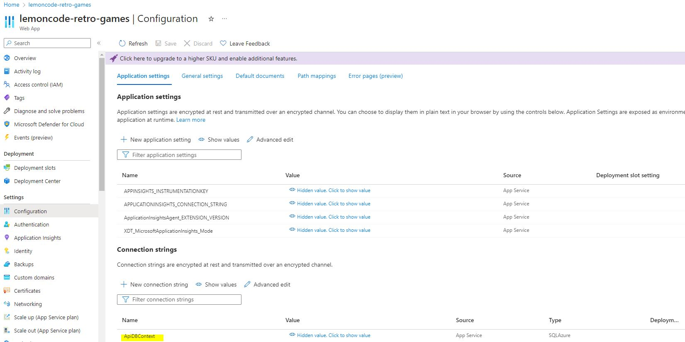
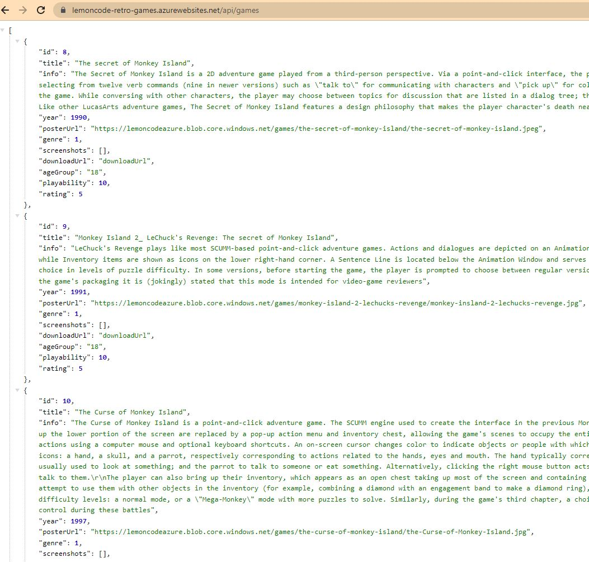
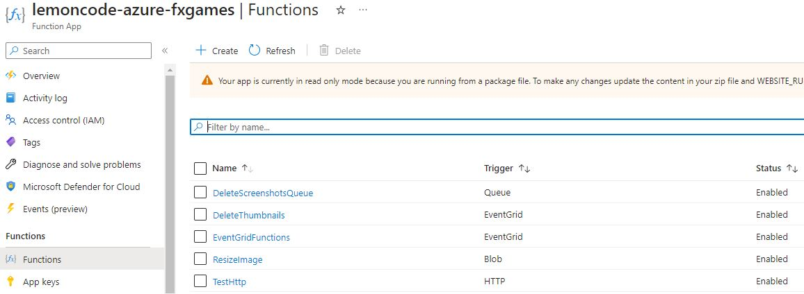

# Prerequisites

1. [Azure portal subscription](#subscription)
2. [Create an Azure storage account](#storage)
3. [Create an Azure SQL Service](#sqlservice)
4. [Create an App Service](#appservice)
5. [Deploy App Service](#deployapi)
6. [Deploy Azure Function App](#deployfunction)

## 1. Azure portal subscription
You need an [Microsoft Azure subscription](https://azure.microsoft.com/free/dotnet/).

## 2. Create an Azure storage account 
Go to [Azure Portal](https://portal.azure.com) and get started with [How to create a storage account](https://learn.microsoft.com/en-us/azure/storage/common/storage-account-create?tabs=azure-portal).

On the Storage accounts page, select Create. On the Basics tab, provide the essential information for your storage account:

|Properties     |  Value 	| Description|
| ----------    |----------------- |---- |
| Subscription | YOURSUBSCRIPTION |  |
| Resource group | lemoncode-azure | Create a new 'resource group' for this storage account |
| Storage account name | lemoncodeazure | Storage account names must be between 3 and 24 characters in length and may contain numbers and lowercase letters only|
| Region | West Europe  | |
| Performance| Standard S0  | |
| Redundancy| Locally-redundant storage (LRS)  | |

After you complete the Basics tab, you can select Review + create.

After creating a storage account, go to the Security + networking section and click on Access keys, then click on the Show keys option which will make all the keys visible. Then copy the connection string of key1.

Now, you need to create the containers where our images will be stored. Get started with [Create a container](https://learn.microsoft.com/en-us/azure/storage/blobs/blob-containers-portal).

A container organizes a set of blobs, similar to a directory in a file system. A storage account can include an unlimited number of containers, and a container can store an unlimited number of blobs.

In the navigation pane for the storage account, scroll to the Data storage section and select Containers.

Within the Containers pane, select the + Container button to open the New container pane.

|Container name     |  Public Acces Level 	| 
| ----------    |----------------- |
| games | Blob |  
| screenshots | Blob |  
| thumbnails | Blob |  

The container name must be lowercase, must start with a letter or number, and can include only letters, numbers, and the dash (-) character. The name must also be between 3 and 63 characters long.

## 3. Create an Azure SQL Service 

Get started with [Follow the instructions on the Azure website](https://learn.microsoft.com/en-gb/azure/azure-sql/database/single-database-create-quickstart?view=azuresql&tabs=azure-portal).

To create an Azure SQL database and SQL Server:

|Properties     |  Value 	       |
| ----------    |----------------- |
| Resource type | Single database |
| Resource group | lemoncode-azure |
| Database name | Lemoncode.Azure.Api.Data |
| Want to use SQL elastic pool| No  |
| Compute + storage| Standard S0  |
| Backup Storage Redundancy| Locally-redundant backup storage  |

For Server, select Create new, and fill out the New server form with the following values:
|Properties     |  Value | 
| ----------    |----------------- |
| Server name | lemoncode-db-server.database.windows.net |
| Location    | West Europe  |
| Authentication method | SQL authentication |
| Server admin login | lemoncodeuser |
| Password	| {your_password}|

Set up server-level firewall rules using Azure Portal
|Properties     |  Value | 
| ----------    |----------------- |
| Public network access | Selected networks |
| Firewall rules | Add your client IPv4 address |
| Firewall rules ONLY for DEV environment | dev-firewall-rule-all 0.0.0.0 255.255.255.255 |
    
Get ADO.NET connection information of the SQL Database 
1. Navigate to the 'Lemoncode.Azure.Api.Data' database in the Azure portal and, under Settings, select Connection strings.
2. Copy the ADO.NET connection string to be used in the App service.

Now that we've created the service, we can access it from the Azure Data Studio desktop app. 
You can run the following SQL Scripts:
|SQL Scripts     |  Description | 
| ----------    |----------------- |
|[CREATE_GAME.sql](db/CREATE_GAME.sql)| Create the Game table |
|[CREATE_SCREENSHOTS.sql](db/CREATE_SCREENSHOTS.sql) | Create the Screenshot table |
|[Lemoncode-data-script.sql](db/Lemoncode-data-script.sql) | Insert Game's entries |

## 4. Create an App Service 
Get started with [App Service overview](https://learn.microsoft.com/en-us/azure/app-service/overview) and [Quickstart: Deploy an ASP.NET web app](https://learn.microsoft.com/en-us/azure/app-service/quickstart-dotnetcore?tabs=net70&pivots=development-environment-vs).

|Properties     |  Value 	| 
| ----------    |----------------- |
|Subscription | YOURSUBSCRIPTION |
| Resource group | lemoncode-azure |
| Name | lemoncode-retro-games |
| Publish | Code |
| Runtime Stack | .NET 6|
| Publish | Code |
| Operating System| Windows |
| Location | West Europe |
| Plan Pricing| F1 |

| Continuous deployment| Enable |
| Organization| monicacrespo|
| Repository| bootcamp-backend-student-azure|
| Branch| main|

Now that we've created the API service we need to configure the database connection string. In the Azure portal, search for and select App Services, and then select your app. In the app's left menu, select Configuration > Application settings. 
Get the ADO database connection string you copied when creating an Azure SQL database and SQL Server.

## 5. Deploy App Service

Now that we've created the api service, we must change our database connection string in code before going on with the deployment.

Get the ADO database connection string you copied when creating an Azure SQL database and SQL Server.

Get the general-purpose Azure storage account connection string you copies when creating an Azure storage account.

Open the Lemoncode.Azure solution, in Lemoncode.Azure.Api project add your database and general-purpose Azure storage account connection strings in the appsettings file.

Now go back to Visual Studio, right click on the project, click on Publish, Click on Start, Select Azure App Service (Windows) as Target, then click on Next, Select Create a new Azure App Service, Select the correct resource group then azure app name `lemoncode-retro-games`, Skip "Create a new API Management Service", then publish.

After doing it, lets upload our API:
https://lemoncode-retro-games.azurewebsites.net/api/games

## 6. Deploy Azure Function App 

Go to Visual Studio, to Lemoncode.Azure.FxGames project, and rename the `deletethisprefix.local.settings.json` file to be `local.settings.json`. Once renamed, inside the Values section replace "MY-AZURE-STORAGE-ACCOUNT-ASSOCIATED-TO-APPLICATION" with your azure general-purpose Azure storage account connection. 

Now right click on the Lemoncode.Azure.FxGames project, click on Publish, Click on Start, Select Azure as Target, then click on Next, Select Azure Function App (Windows), Select the correct resource group then azure function app name, then publish.

After successfully publishing, go to Azure Portal, check the functions have been published successfully or not.

